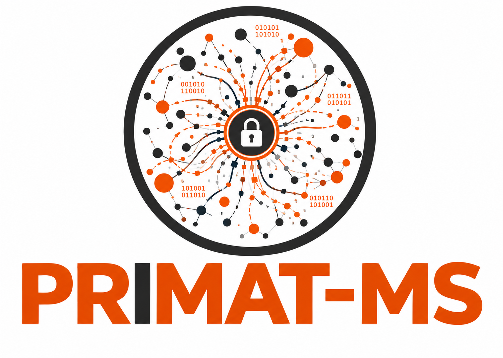
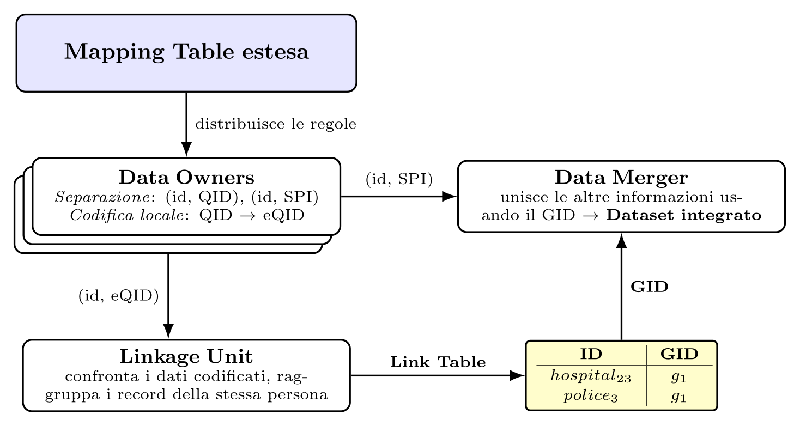

# PRIMAT: Private Matching Toolbox

PRIMAT is an open source (ALv2) toolbox for the definition and execution of PPRL (Privacy-Preserving
Record Linkage) workflows. It offers modules for data owners and the linkage unit that provide
state-of-the-art PPRL methods, including Bloom-filter-based encoding and hardening techniques,
LSH-based blocking, post-processing (clustering) and more.

[PRIMAT](https://dl.acm.org/citation.cfm?doid=3352063.3360392) is developed by the
[Database Group](https://dbs.uni-leipzig.de/research/projects/pper_big_data) of the University of
Leipzig, Germany. This fork (**PRIMAT-MS**) extends the original library into a set of
MQTT-orchestrated microservices, ready for integration as a privacy-preserving record-linkage
component inside a [MOMIS](https://www.datariver.it/) data-integration pipeline.

## PRIMAT Modules

Core PPRL libraries (unchanged from upstream PRIMAT):

- `primat-common` - Shared data model and utility functions (input file handling, hashing, feature extraction).
- `primat-data-owner` - Pre-processing functions and techniques to encode/mask records for PPRL.
- `primat-linkage-unit` - Batch and incremental linkage workflows: blocking, similarity calculation, classification, post-processing (clustering) and evaluation.
- `primat-analysis` - Tools for analyzing records and error types.
- `primat-examples` - Example workflows showing use cases for PRIMAT.

Microservice layer (this fork):

- `primat-mqtt-common` - Single source of truth for MQTT topic naming and the wire-format DTOs shared by every service.
- `primat-data-owner-service` - Long-running Data Owner process: applies configuration pushed by the SMU, preprocesses/encodes local records and publishes the resulting Bloom Filters.
- `primat-linkage-unit-service` - Long-running Linkage Unit process: collects the encoded records of a run and performs blocking/matching/clustering.
- `primat-smu` (Python) - Schema Mapping Unit: owns the shared configuration, pushes it to every Data Owner, and orchestrates each run (version check, Linkage Unit setup, run start, result collection).

## Privacy-preserving Record Linkage

- Task of identifying records in different databases that refer to the same real-world entity.
- Protection of sensitive personal information: only irreversibly encoded data ever leaves a source.
- Applications in medicine & healthcare, national security and marketing analysis.

### Key Challenges

- Guarantee privacy by minimizing disclosure risk.
- Scalability to millions of records.
- High linkage quality.

## Architecture: from a library to orchestrated microservices

PRIMAT-MS turns the original library into a small set of cooperating services, driven by a single
shared specification (an extended *Mapping Table*, in the MOMIS sense) instead of ad-hoc,
per-source configuration:

| Component | Role | What it sees |
|---|---|---|
| **SMU** (`primat-smu`) | Owns and distributes the shared configuration (schema + encoding), tracks each Data Owner's applied version, orchestrates every run. | Versioned metadata and approval state of every Data Owner — never the records themselves. |
| **Data Owner** (`primat-data-owner-service`) | Applies the configuration pushed by the SMU, pre-processes and encodes its local records on every run. | Its own data in clear text, and only its own mapping rules. |
| **Linkage Unit** (`primat-linkage-unit-service`) | Compares the encoded fingerprints received from all Data Owners and clusters matching records under a shared global id (GID). | Only identifiers, encoded data and configuration digests — **never** clear-text data or mapping rules. |

Each QID-type attribute (a *Quasi-Identifier*, e.g. name/surname/date of birth) is used only for
linkage and is always encoded (Bloom Filter) before leaving a Data Owner; any other, sensitive
attribute (SPI) never takes part in the linkage and stays local until a later Data Fusion step, out
of PRIMAT-MS's scope, reconciles it by GID.

### Logical flow of a run

1. The SMU pushes the shared configuration (schema + encoding) to every Data Owner, which applies
   it locally and acknowledges.
2. On "Avvia esecuzione", the SMU verifies that every Data Owner has already applied the latest
   configuration, then pushes the expected digest/parameters to the Linkage Unit.
3. The SMU starts the run on every Data Owner, which preprocesses and encodes its local records
   (clear-text data never leaves the Data Owner) and publishes the resulting Bloom Filters.
4. The Linkage Unit collects every Data Owner's encoded records for that run, verifies their
   configuration digest, performs blocking/matching/clustering, and reports the outcome (clusters
   produced) back to the SMU.

See `primat-master/ARCHITECTURE_FLOW.md` and `primat-master/CONCEPTUAL_FLOW.md` for the full
protocol detail, and `primat-master/TESTING.md` to run it end-to-end locally.

### Functional Overview

|Component/Module | Function/Feature | Status |
|-----------------|------------------|--------|
| Data generator & corruptor | - Data generation  - Data corruption | Integration outstanding Planned |
| Data cleaning | - Split/merge/remove attributes - Replace/remove unwanted values - OCR transformation | Implemented Implemented Implemented |
| Encoding | - Bloom filter encoding - Bloom filter hardening techniques - Support of alternative encoding schemes| Implemented Implemented Partially implemented |
| Blocking | - Standard blocking  - LSH-based blocking| Implemented Implemented |
| Matching | - Threshold-based classification - Post-processing - Multi-threaded execution - Distributed matching - Multi-Party support, match cluster management - Incremental Matching | Implemented Implemented Partially implemented Integration outstanding Implemented Implemented |
| Evaluation | - Measures for assessing quality & scalability - Masked match result visualization | Implemented Integration outstanding |
| Orchestration (microservices) | - MQTT-driven config push + version check - Hot reconfiguration of a running Linkage Unit - Run start/result reporting | Implemented |

Unsupervised precision/recall estimation methods (no ground truth required) are also available, in
package `de.uni_leipzig.dbs.pprl.primat.lu.quality_estimation`.

### Requirements

- Java 11+
- Maven
- Python 3 (for `primat-smu`)
- An MQTT broker (e.g. Mosquitto) reachable by all services
- Ubuntu (recommended)
- PostgreSQL (for incremental matching)

#### Database Setup

- Required for incremental matching, and for the 4 persistent clustering strategies of `primat-linkage-unit-service` (Center Clustering, MSCD-AP, Global Greedy, CLIP — stable cluster ids across runs; MCL is the only non-persistent strategy — see `primat-master/ARCHITECTURE_FLOW.md`)
- Each strategy uses its own dedicated PostgreSQL database (`primat_center_clustering`, `primat_mscd_ap`, `primat_global_greedy`, `primat_clip`); see `primat-master/TESTING.md` section 1 for the exact `docker`/`createdb` commands, and `primat-master/db_reset_scripts/reset_db.py` to empty one or all of them
- Edit the `persistence.xml` file under `primat-master/primat-linkage-unit/src/main/resources/META-INF/persistence.xml` and change the connection properties according to your configuration if not using the defaults (`primat`/`primat`)

## Future Plans

We plan to gradually add new features related to our ongoing research.

## Contributors

- Florens Rohde
- Victor Christen
- Ziad Sehili
- Thomas Hoppe
- Duc Dung Dao
- Marcel Gladbach
